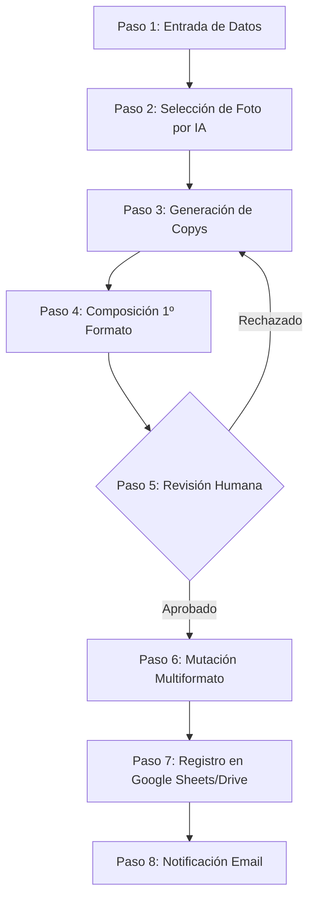

# 🚀 GenBanner IA: Sistema de Generación Automatizada de Banners Creativos

> **Plataforma Web Interna "Human-in-the-Loop"** diseñada para automatizar el workflow de creación, composición y reescalado de banners creativos utilizando Inteligencia Artificial Generativa y Orquestación Lógica.

> [!NOTE]
> **Desarrollo con Inteligencia Artificial:** Este proyecto ha sido diseñado e implementado en colaboración con **Google Antigravity**, optimizando la automatización del workflow creativo mediante agentes autónomos de IA.

---

## 📋 Índice
1. [Resumen Ejecutivo](#-resumen-ejecutivo)
2. [Arquitectura y Stack Tecnológico](#-arquitectura-y-stack-tecnológico)
3. [Flujo de Trabajo (Workflow)](#-flujo-de-trabajo-workflow)
4. [Métricas de Éxito (KPIs)](#-métricas-de-éxito-kpis)
5. [Estructura del Proyecto](#-estructura-del-proyecto)
6. [Próximos Pasos](#-próximos-pasos)

---

## 💡 Resumen Ejecutivo

### El Problema Core ⏳
Actualmente, la agencia de medios produce aproximadamente **100 campañas de autopromoción al mes**. Cada campaña requiere entre 3 y 8 formatos de banner (horizontal, vertical, cuadrado). El equipo creativo realiza este proceso de forma **100% manual**, lo que consume:
* **45 minutos** de media por campaña.
* **75 horas/mes** de trabajo puramente mecánico.
* Un coste operativo directo de **1.875 €/mes (~22.500 €/año)**.
* Bloqueo de perfiles creativos de alto valor en tareas de redimensionamiento repetitivas.

### La Solución 🧠
**GenBanner IA** es una solución interactiva de tipo **Human-in-the-Loop (HITL)** que combina automatización, procesamiento de lenguaje natural (LLM) y APIs de generación gráfica. La plataforma ingiere un artículo, analiza semánticamente su contenido para elegir la mejor imagen del DAM corporativo, propone copys/CTAs optimizados para cada formato y renderiza instantáneamente variantes profesionales.

> [!IMPORTANT]
> **Filosofía Human-in-the-Loop:** El sistema restringe el bypass automático. Bajo ninguna circunstancia una campaña pasará directamente del formulario de entrada al empaquetado final sin haber sido validada y aprobada explícitamente por el **Supervisor Creativo**.

---

## 🛠️ Arquitectura y Stack Tecnológico

El proyecto está diseñado para implementarse con un stack moderno, ágil y escalable:

| Componente | Tecnología Propuesta | Función Principal |
| :--- | :--- | :--- |
| **Frontend** | **Next.js (App Router) + CSS/Tailwind** | Interfaz del formulario, edición inline de copys y panel de aprobación. |
| **Orquestación** | **N8N** (o Make) | Motor de flujo que recibe webhooks, encadena APIs de IA y gestiona la lógica condicional. |
| **LLM (Textos/Justificación)**| **GPT-4o (OpenAI)** / **Claude 3.5 Sonnet** | Comprensión del artículo, redacción de CTAs y justificación creativa de imágenes. |
| **Generación Gráfica** | **Bannerbear** / **Placid.app** | Renderizado automatizado basado en plantillas dinámicas con Smart Cropping. |
| **Persistencia y Logs** | **Google Sheets & Google Drive** | Base de datos ligera para logs y almacenamiento estructurado de ZIPs. |
| **Notificaciones** | **Gmail / SendGrid (N8N)** | Envío automatizado al Ejecutivo de Cuentas con enlace de descarga. |

---

## 🔄 Flujo de Trabajo (Workflow)

El pipeline de GenBanner IA consta de **8 pasos secuenciales** perfectamente orquestados:



### Detalle del Flujo de Trabajo

1. **Entrada de Datos (Ejecutivo de Cuentas):** Se introduce la URL del artículo o texto plano y se seleccionan los formatos de banner deseados (ej. *Horizontal 1200×628*, *Cuadrado 1080×1080*, *Vertical 1080×1920*).
2. **Selección Inteligente de Imagen (IA Visual):** El motor semántico encuentra el asset idóneo en el banco corporativo y genera un bloque obligatorio de `"Justificación Creativa de la IA"`.
3. **Generación de Copys:** Creación de variantes de titular, subtítulo y CTA bajo restricciones estrictas de longitud física.
4. **Composición del Formato Base:** Bannerbear inyecta el asset base y copys en la plantilla base para generar la primera previsualización en tiempo real.
5. **Revisión y Aprobación (Supervisor Creativo):** El supervisor evalúa el diseño y la justificación. Puede editar inline los copys antes de aprobar o rechazar con comentarios.
6. **Mutación Multiformato:** Tras la aprobación, se disparan los renders en lote de todos los formatos adicionales usando *Smart Cropping* (reencuadre inteligente centrado en el sujeto).
7. **Empaquetado y Registro:** Se genera un archivo `.zip` estructurado siguiendo la nomenclatura normalizada:
   `[AAAA-MM-DD]_[NombreCampaña]_[ID_Campaña].zip`
   Se guarda en Google Drive y se registra el log en la hoja maestro de Google Sheets.
8. **Notificación de Cierre:** Envío de correo en HTML limpio con enlace directo de descarga pública.

---

## 📈 Métricas de Éxito (KPIs)

* **OBJ-01:** Reducir el tiempo medio por campaña de 45 minutos a **≤ 10 minutos**.
* **OBJ-02:** Lograr una **tasa de aprobación de ≥ 75%** por parte del supervisor en la primera revisión.
* **OBJ-03:** Reducir a **0 horas mecánicas** el trabajo de adaptación de formatos (recuperación de **75 horas/mes** reasignadas a estrategia).
* **OBJ-04:** Lograr una **adopción interna de ≥ 90%** de las campañas mensuales procesadas a través del sistema.

---

## 📂 Estructura del Proyecto

```bash
JF-Proy-Antigravity-Auto-Banners/
├── Docs/
│   ├── prd-servicio-auto-banners.md     # Documento de Requisitos del Producto (PRD)
│   └── prompt-generacion-prd.md          # Instrucciones y prompts utilizados para el PRD
├── Scripts/
│   └── create_workflow.py                # Script de automatización de creación de workflow en AntigravityIDE
├── .gitignore                            # Exclusión de entornos, dependencias y archivos de sistema
└── README.md                             # Documentación principal del proyecto
```

---

## 🚀 Próximos Pasos

1. **Configurar el Entorno Local:** Inicializar la aplicación Next.js y estructurar el diseño de la interfaz de usuario.
2. **Integrar Plataforma de Diseño (Bannerbear/Placid):** Crear las plantillas maestras reutilizables para los formatos horizontal, vertical y cuadrado.
3. **Desarrollar el Flujo de Orquestación en N8N:** Configurar los nodos para la ingesta, API de OpenAI/Anthropic, Bannerbear, Google Sheets/Drive y Gmail.
4. **Pruebas Integradas (E2E):** Ejecución de punta a punta del workflow validando el rendimiento (primer banner base en ≤ 60s, lote completo en ≤ 120s).
